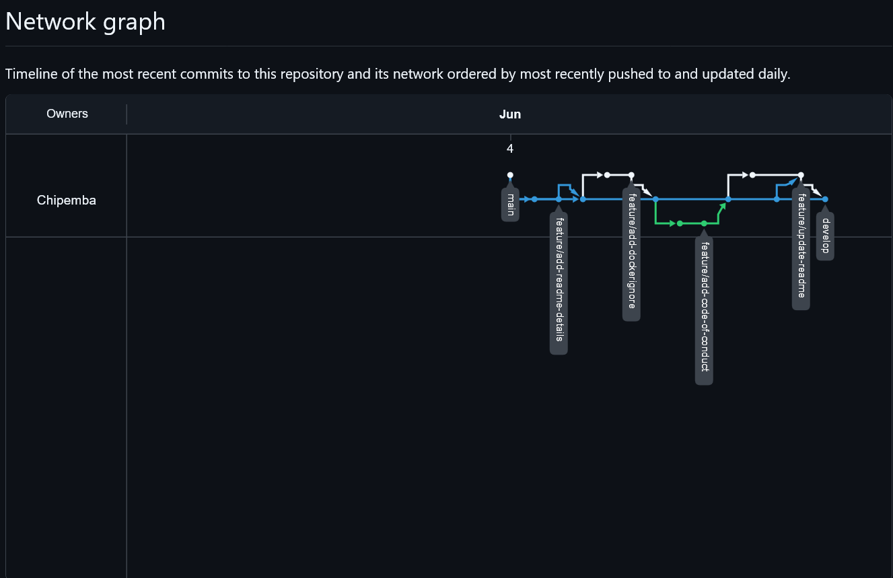
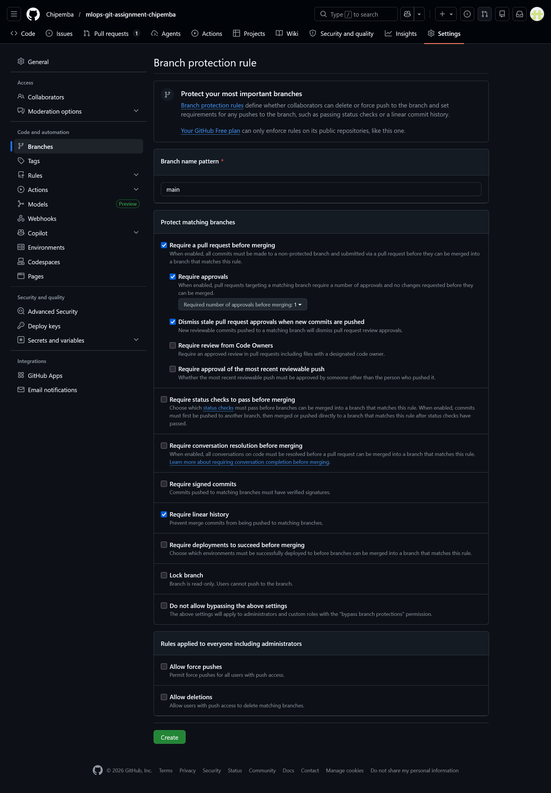

# MAI201 MLOps Assignment 1 Report

## Student Information

Name: Chipemba Bwacha  
Student ID: 046975124 
Course: MAI201 MLOps  
Assignment: Assignment 1 - Git Branching & Collaboration  
Repository Name: https://github.com/Chipemba/mlops-git-assignment-chipemba.git

---

## 1. GitHub Network Graph

The screenshot below shows the GitHub network graph for the repository. It displays the branches created during the assignment and the merge history from the feature branches into the `develop` branch.




---

## 2. Branch Protection Rules

The screenshot below shows the branch protection rules configured for the `main` branch.

The following rules were enabled:

- Require a pull request before merging
- Require at least one approval
- Dismiss stale pull request approvals when new commits are pushed
- Require linear history
- Disable force pushes
- Disable branch deletion




---

## 3. Git Log Output

The following command was used to display the branch and commit history:

```bash
git log --oneline --graph --all --decorate
```

Output:


*   bfd2042 (HEAD -> develop, origin/develop) Merge pull request #4 from Chipemba/feature/update-re
adme
|\
| *   1b2f87c Merge branch 'develop' into feature/update-readme
| |\
| |/
|/|
* | c4674a4 Add course information to README
| * 445fd24 (origin/feature/update-readme, feature/update-readme) Add student information to README
|/
*   1555378 Merge pull request #3 from Chipemba/feature/add-code-of-conduct
|\
| * 26680f1 (origin/feature/add-code-of-conduct, feature/add-code-of-conduct) Add code of conduct s
cope
| * b3c731d Add code of conduct
|/
*   0121c90 Merge pull request #2 from Chipemba/feature/add-dockerignore
|\
| * e4f071e (origin/feature/add-dockerignore, feature/add-dockerignore) Add build artifacts to Dock
er gnore
| * de24122 Add Docker ignore file
|/
*   c6f6917 Merge pull request #1 from Chipemba/feature/add-readme-details
|\
| * a9828f2 (origin/feature/add-readme-details, feature/add-readme-details) Add projec description
:


---

## 4. Merge Conflict Reflection

The most challenging part of resolving the merge conflict was understanding why Git could not automatically combine the changes. The conflict happened because the `feature/update-readme` branch and the `develop` branch both changed the README file in a similar area.

To resolve the conflict, I reviewed both versions of the file and removed the conflict markers. I kept both changes by including the student information from the feature branch and the course information from the develop branch. After resolving the conflict, I completed the pull request merge.

This process helped me understand that merge conflicts are not necessarily mistakes. They are situations where Git needs the developer to decide how different changes should be combined. I also learned the importance of pulling the latest changes from the base branch before starting new work.
